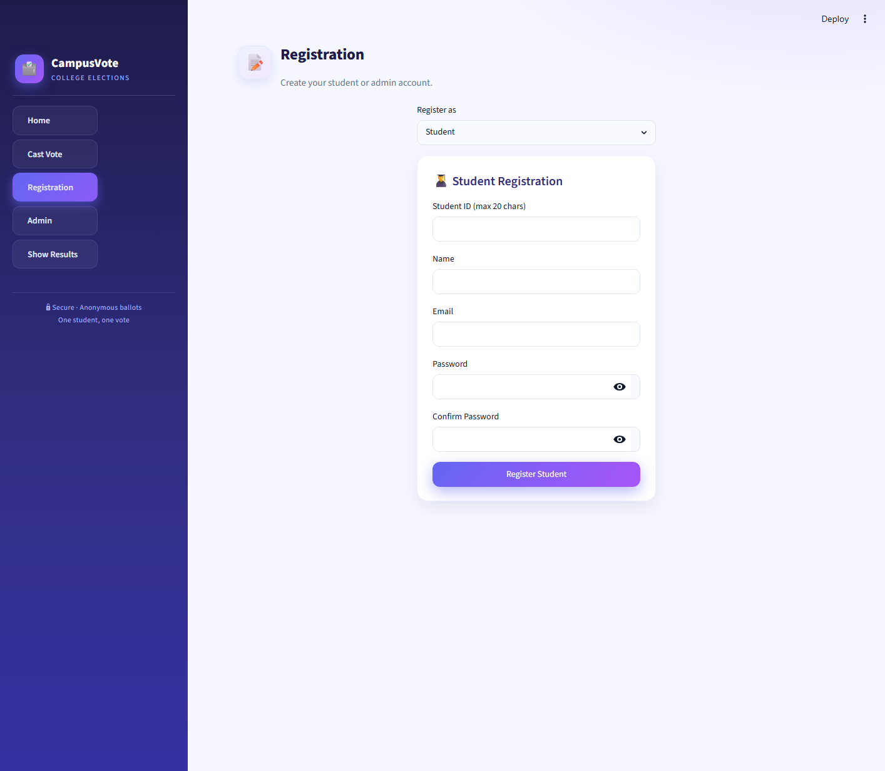
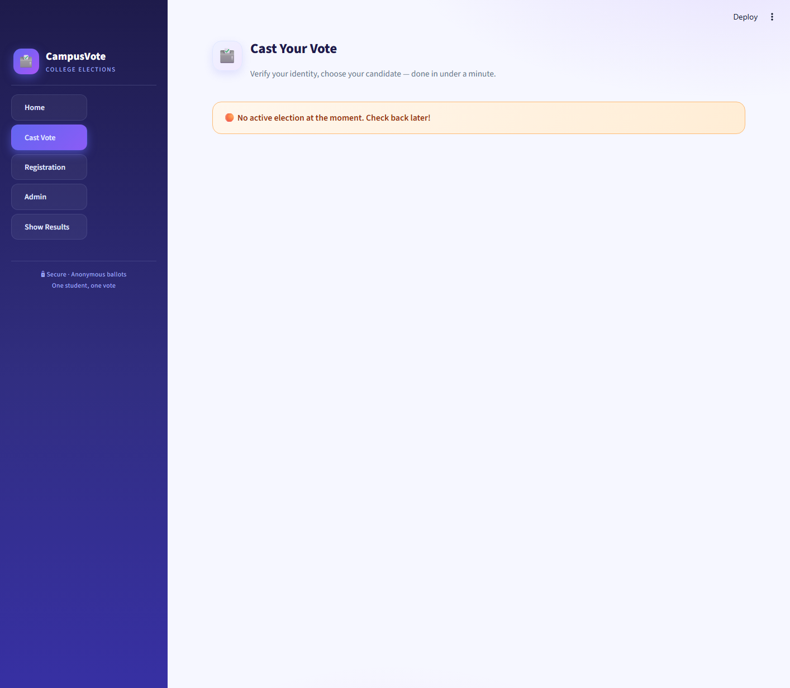
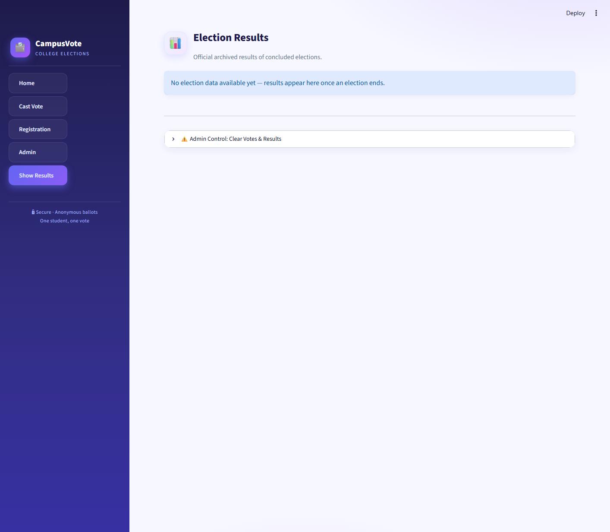

# 🗳️ CampusVote — Online Voting System

A modern, secure web-based voting system for college and student elections, built with **Streamlit** and **MySQL**. Students register and cast one anonymous vote per election; admins create elections, monitor turnout live, and publish results with charts.

> **Created by [Prashant Saini](https://github.com/prashant-GKV)** 👨‍💻


---

## ✨ Features

| For Students | For Admins |
|---|---|
| 📝 Quick registration with college ID & email | 🚀 Create elections with 2–10 candidates |
| 🔐 Secure login (bcrypt-hashed passwords) | 📈 Live monitor: votes cast & turnout % |
| 🗳️ One vote per student — enforced at the database level | 🧑‍🎓 Searchable student roster |
| 🕵️ Anonymous ballots — your choice is never stored with your identity | 🏁 End elections & auto-publish results |
| 📊 View official results with charts & winner highlights | 🧹 Reset votes & results (with confirmation) |

### 🔒 Security Highlights

- **Passwords are never stored in plain text** — bcrypt hashing for both students and admins
- **Double voting is impossible** — a database `UNIQUE(student_id, election_id)` constraint blocks it even under concurrent requests
- **Ballot secrecy** — the vote record only proves *that* you voted, never *who* you voted for
- **Admin accounts are protected** — registering as admin requires a secret setup code
- **Live counts are admin-only** during an active election, so results can't influence turnout

---

## 📸 Screenshots

| Registration | Cast Vote | Results |
|---|---|---|
|  |  |  |

---

## 🚀 Quick Start

### Prerequisites

- **Python 3.10+** — [download](https://www.python.org/downloads/)
- **MySQL Server 8+** — [download](https://dev.mysql.com/downloads/) (or install with `winget install Oracle.MySQL` on Windows)

### 1. Clone & set up (one time)

```bash
git clone https://github.com/prashant-GKV/Online-Voting-System.git
cd Online-Voting-System
pip install -r requirements.txt
mysql -u root -p < schema.sql
```

> 💡 **Windows shortcut:** just double-click **`setup.bat`** — it installs the dependencies and creates the database for you.

### 2. Run the app

```bash
python -m streamlit run online_voting_system.py
```

> 💡 **Windows shortcut:** just double-click **`run.bat`**.

Then open **http://localhost:8501** in your browser. That's it! 🎉

---

## ⚙️ Configuration

The app works out of the box with these defaults, all overridable via environment variables:

| Variable | Purpose | Default |
|---|---|---|
| `MYSQL_HOST` | Database host | `localhost` |
| `MYSQL_USER` | Database user | `root` |
| `MYSQL_PASSWORD` | Database password | `prashant@123` |
| `MYSQL_DATABASE` | Database name | `voting_system` |
| `ADMIN_SETUP_CODE` | Secret code required to register an admin account | `CollegeVote#2026` |

> ⚠️ **Before using this for a real election:** change `MYSQL_PASSWORD` and `ADMIN_SETUP_CODE` to your own private values. Either edit the defaults at the top of `online_voting_system.py` or set the environment variables.

If your MySQL root password is different from the default, set it before running:

```powershell
# PowerShell
$env:MYSQL_PASSWORD = "your-mysql-password"
python -m streamlit run online_voting_system.py
```

---

## 📖 How to Use

### As a Student
1. Go to **Registration** → register as *Student* with your college ID, email, and a password
2. Go to **Cast Vote** → verify with your ID & password
3. Pick your candidate → **Submit My Vote** ✅ (you can only vote once per election)
4. After the election ends, check **Show Results**

### As an Admin
1. Go to **Registration** → register as *Admin* (you'll need the **admin setup code**)
2. Go to **Admin** → log in
3. **Create Election** → name it, add 2–10 candidates, start it
4. **Live Monitor** → watch votes and turnout in real time
5. **End Election** → confirms, archives the results, and publishes them on **Show Results**

---

## 🛠️ Tech Stack

- **Frontend & Backend:** [Streamlit](https://streamlit.io/) (Python)
- **Database:** [MySQL](https://www.mysql.com/) via `mysql-connector-python`
- **Security:** `bcrypt` password hashing
- **Charts:** [Altair](https://altair-viz.github.io/) + custom CSS theme

## 📂 Project Structure

```
├── online_voting_system.py   # The entire app (UI + logic)
├── schema.sql                # Database schema — run once to set up MySQL
├── requirements.txt          # Python dependencies
├── setup.bat                 # Windows: one-click setup
├── run.bat                   # Windows: one-click run
├── .streamlit/config.toml    # Streamlit theme configuration
└── docs/screenshots/         # UI screenshots
```

---

## 👨‍💻 Author

**Prashant Saini** — [github.com/prashant-GKV](https://github.com/prashant-GKV)

---

## 📄 License

This project is open-source and available under the [MIT License](LICENSE).
